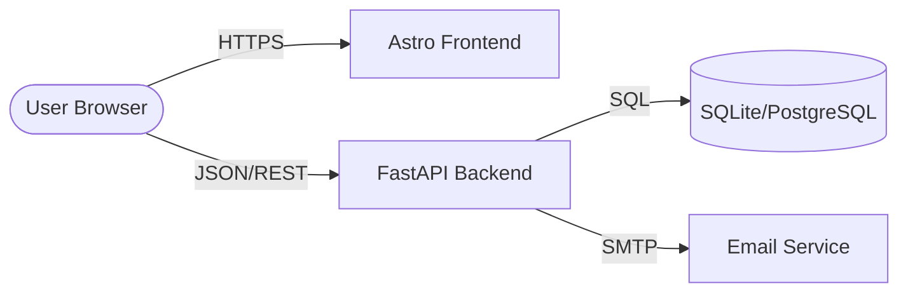

# Architecture Overview

The Cyberfyx website is built as a modern, decoupled web application consisting of a high-performance **Astro 4.x** frontend and a robust **FastAPI** backend. 

## High-Level Diagram

## Component Roles

### 🚀 Astro Frontend (`/frontend-astro`)
- **Primary Function**: Delivers a blazing-fast, SEO-optimized static site.
- **Key Features**:
  - **Static Site Generation (SSG)**: All marketing pages are pre-rendered at build time.
  - **Minimal Client-Side JS**: Uses vanilla TypeScript for interactive elements like the theme toggle, navigation, and contact form submission.
  - **Design System**: A custom-built system using Vanilla CSS with high-end glassmorphism and canvas animations.
  - **API Integration**: Communicates with the backend for dynamic features like inquiry handling.

### ⚙️ FastAPI Backend (`/backend`)
- **Primary Function**: Manages data persistence, lead routing, and internal administrative workflows.
- **Key Features**:
  - **Modular Monolith**: Organized into internal and public API routers.
  - **Data Integrity**: Uses SQLAlchemy ORM with Alembic for robust schema migrations.
  - **Outbox Pattern**: Ensures reliable notification delivery via background workers.
  - **Security**: Implements JWT-based authentication for internal staff endpoints.

## Interaction Flow

1. **Inquiry Submission**:
   - The user fills out a contact form on the Astro site.
   - A client-side script (`contact-form.ts`) sends a `POST` request to `/api/v1/public/inquiries`.
   - The backend validates the input, persists it to the database, and queues an outbox notification.
2. **Notification Delivery**:
   - A separate worker process (`app.worker`) monitors the outbox.
   - If SMTP is configured, it sends an email notification to the relevant staff or the user.

## Deployment Strategy

The application is designed to be containerized using a single Docker image (located in `backend/Dockerfile`) that serves both the FastAPI API and the pre-built Astro static assets, simplifying deployment and ensuring consistency across environments.
